# RZEM AI Inference - API Documentation

This document provides comprehensive API documentation for the Tauri IPC commands used between the Vue frontend and Rust backend.

## Overview

This is a **Tauri application** using IPC (Inter-Process Communication) rather than traditional REST APIs:
- Backend defines commands with `#[tauri::command]`
- Frontend calls them via `invoke('command_name', payload)`
- All communication is type-safe and serialized via Serde

## API Endpoints Summary

| Category | Commands |
|----------|----------|
| App Initialization | `health_check`, `init_database` |
| Generation Queue | `add_to_queue`, `get_queue_jobs`, `get_queue_job`, `cancel_queue_job`, `clear_completed_jobs` |
| Gallery | `get_gallery_images`, `search_gallery_images`, `toggle_favorite`, `add_image_tag`, `remove_image_tag`, `delete_gallery_image` |
| Models | `get_available_models`, `get_model_status`, `check_models_downloaded`, `download_flux_schnell`, `download_flux_dev` |
| Cache | `get_cache_stats`, `get_cache_config`, `set_cache_config`, `set_cache_preset`, `clear_model_cache` |
| API Keys | `get_hf_token`, `set_hf_token`, `get_claude_api_key`, `set_claude_api_key`, `get_fal_key`, `set_fal_key` |
| Image Analysis | `analyze_image_for_prompt`, `read_image_metadata` |

---

## Sequence Diagrams

### 1. Application Initialization Flow

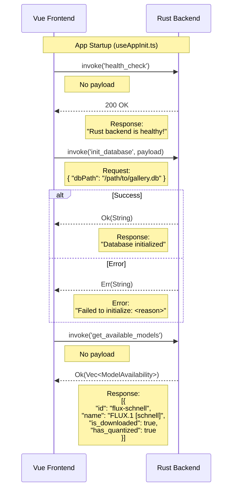

---

### 2. Image Generation Queue Flow

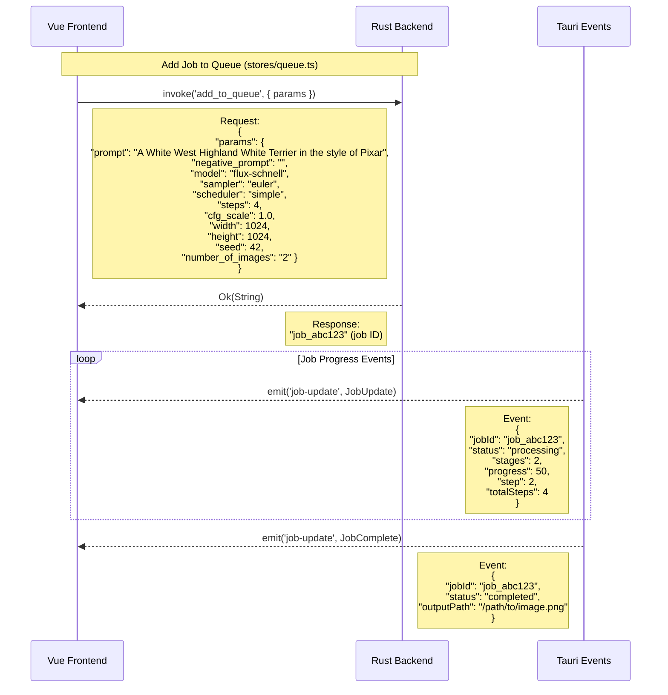

---

### 3. Queue Management Flow

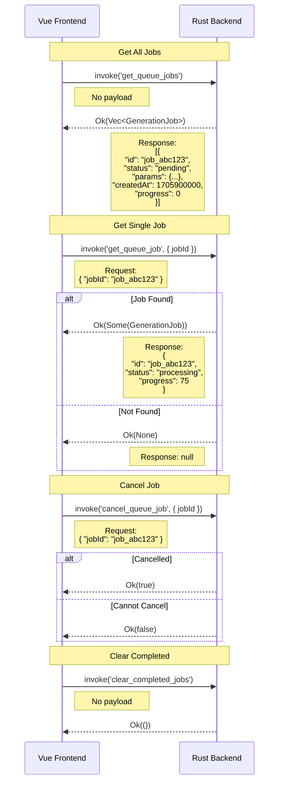

---

### 4. Gallery Management Flow

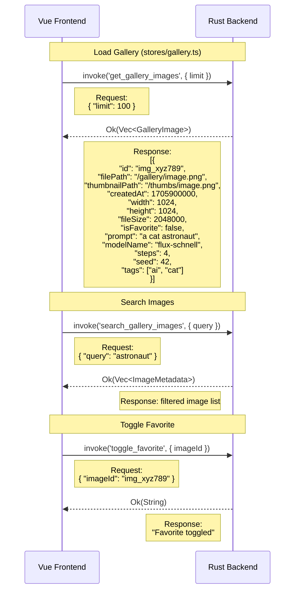

---

### 5. Gallery Tags Flow

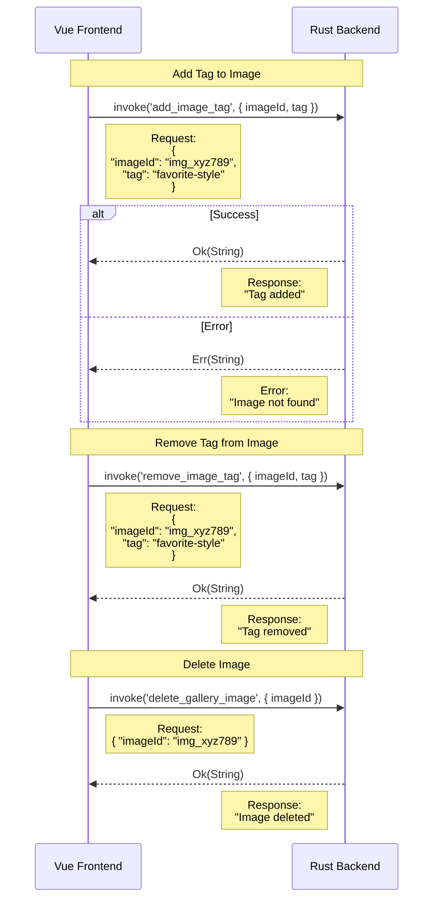

---

### 6. Model Management Flow

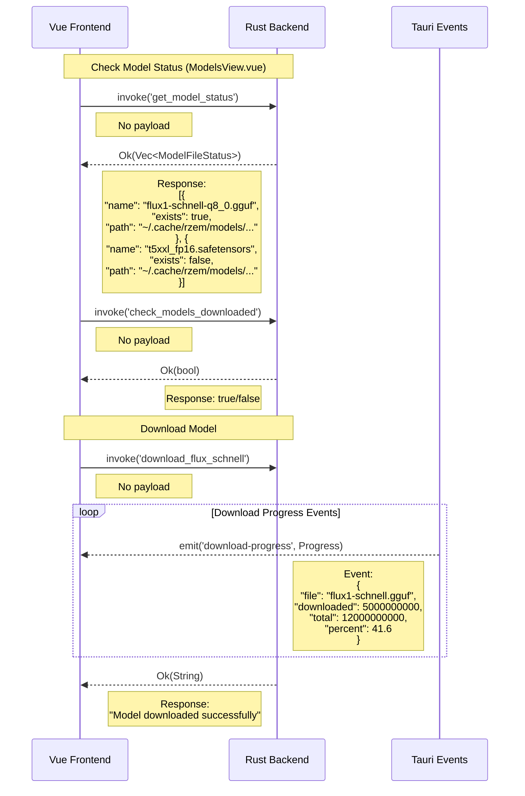

---

### 7. Cache Management Flow

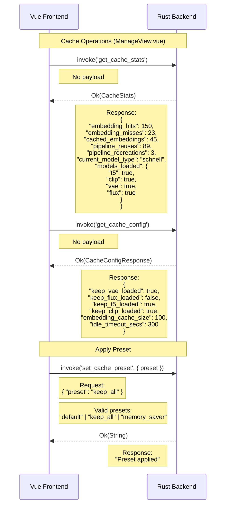

---

### 8. Cache Configuration Flow

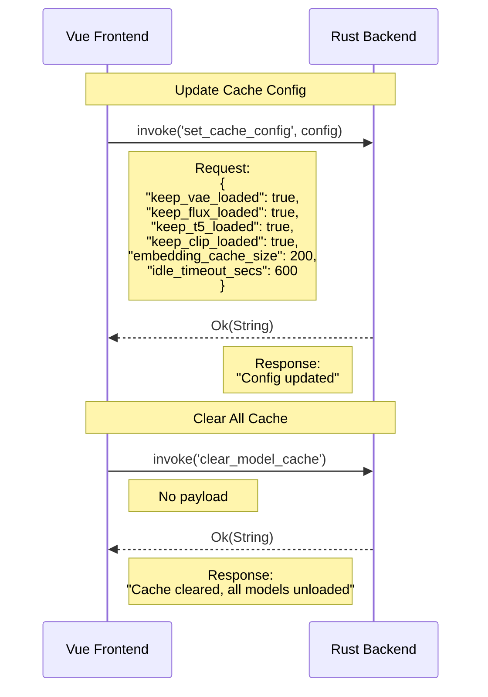

---

### 9. API Key Management Flow

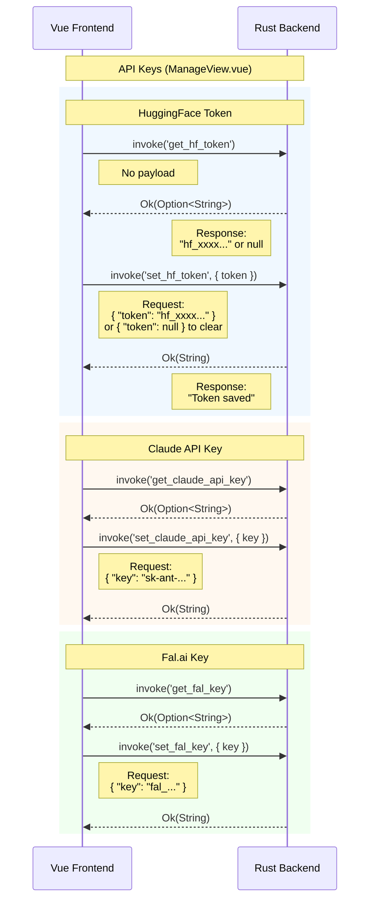

---

### 10. Image Analysis Flow

```mermaid
sequenceDiagram
    participant Vue as Vue Frontend
    participant Rust as Rust Backend
    participant Claude as Claude API

    Note over Vue,Rust: Analyze Image for Prompt (imageAnalysis.ts)

    Vue->>Rust: invoke('analyze_image_for_prompt', payload)
    Note right of Vue: Request:<br/>{<br/>  "imageData": "data:image/png;base64,iVBOR...",<br/>  "mediaType": "image/png"<br/>}

    Rust->>Claude: POST /v1/messages
    Note right of Rust: Sends image to Claude<br/>for analysis
    Claude-->>Rust: Analysis response

    alt Success
        Rust-->>Vue: Ok(String)
        Note left of Rust: Response:<br/>"A detailed photograph of a sunset<br/>over mountains with vibrant orange<br/>and purple hues..."
    else API Error
        Rust-->>Vue: Err(String)
        Note left of Rust: Error:<br/>"Claude API error: Invalid API key"
    end

    Note over Vue,Rust: Read Image Metadata
    Vue->>Rust: invoke('read_image_metadata', { imagePath })
    Note right of Vue: Request:<br/>{ "imagePath": "/gallery/image.png" }

    alt Has Metadata
        Rust-->>Vue: Ok(Some(Value))
        Note left of Rust: Response:<br/>{<br/>  "prompt": "original prompt",<br/>  "seed": 42,<br/>  "steps": 4,<br/>  "model": "flux-schnell"<br/>}
    else No Metadata
        Rust-->>Vue: Ok(None)
        Note left of Rust: Response: null
    end
```

---

### 11. Direct Generation Flow (Legacy)

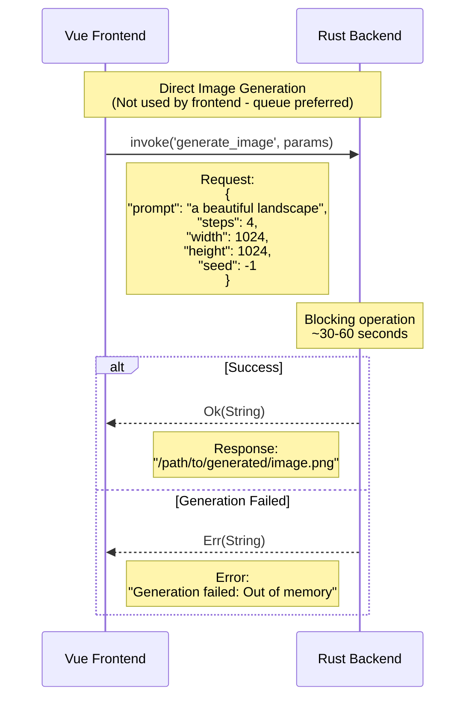

---

## Error Response Patterns

All commands follow this error pattern:

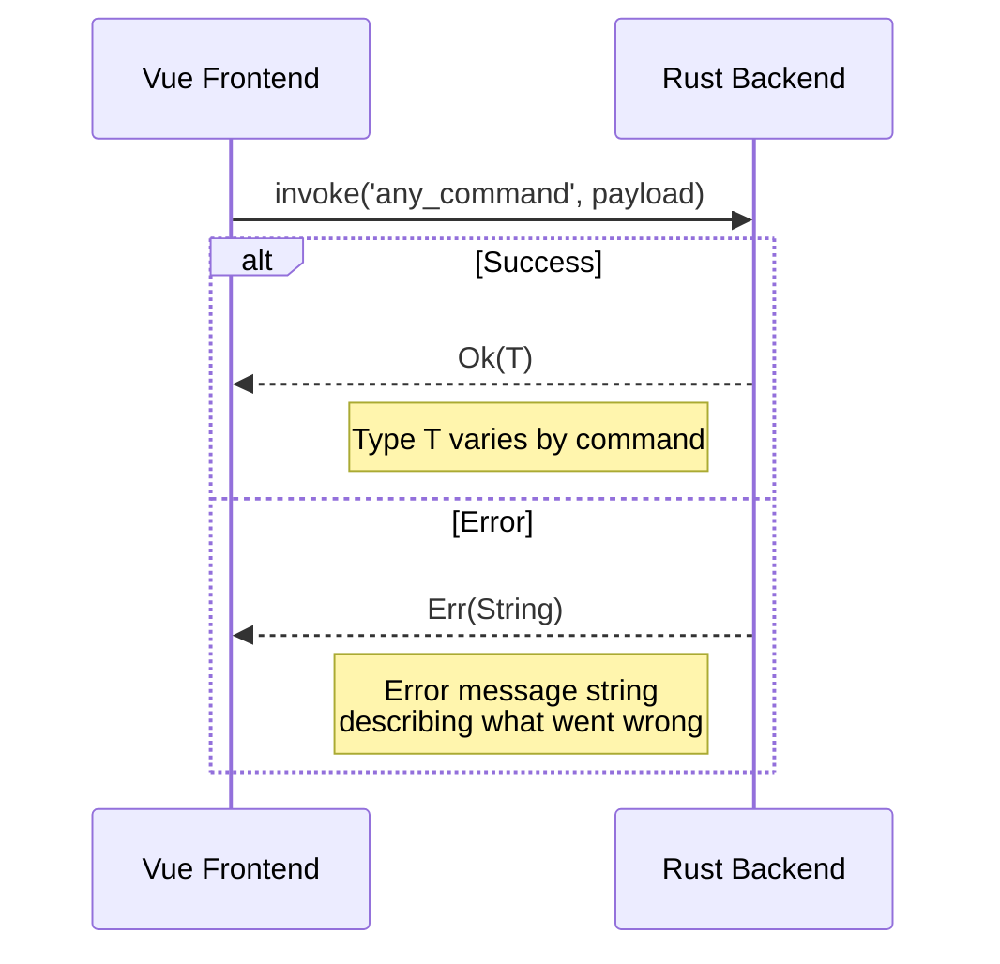

### Common Error Scenarios

| Error Type | Example Message |
|------------|-----------------|
| Database errors | `"Failed to query database: ..."` |
| File not found | `"Image not found: ..."` |
| Model errors | `"Model not downloaded"` |
| API errors | `"API key not configured"` |
| Generation errors | `"Generation failed: Out of memory"` |

---

## Data Types Reference

### GenerationParams
```typescript
interface GenerationParams {
  prompt: string;
  negative_prompt?: string;
  steps: number;
  cfg_scale: number;
  width: number;
  height: number;
  seed: number;
  model: string;
}
```

### GenerationJob
```typescript
interface GenerationJob {
  id: string;
  status: 'pending' | 'processing' | 'completed' | 'failed' | 'cancelled';
  params: GenerationParams;
  createdAt: number;
  progress: number;
  step?: number;
  totalSteps?: number;
  outputPath?: string;
  error?: string;
}
```

### GalleryImage
```typescript
interface GalleryImage {
  id: string;
  filePath: string;
  thumbnailPath?: string;
  createdAt: number;
  width: number;
  height: number;
  fileSize: number;
  isFavorite: boolean;
  prompt: string;
  negativePrompt?: string;
  modelName: string;
  steps?: number;
  cfgScale?: number;
  seed?: number;
  sampler?: string;
  tags: string[];
}
```

### ModelAvailability
```typescript
interface ModelAvailability {
  id: string;
  name: string;
  is_downloaded: boolean;
  has_quantized: boolean;
}
```

### CacheStats
```typescript
interface CacheStats {
  embedding_hits: number;
  embedding_misses: number;
  cached_embeddings: number;
  pipeline_reuses: number;
  pipeline_recreations: number;
  current_model_type: string | null;
  models_loaded: {
    t5: boolean;
    clip: boolean;
    vae: boolean;
    flux: boolean;
  };
}
```

### CacheConfig
```typescript
interface CacheConfig {
  keep_vae_loaded: boolean;
  keep_flux_loaded: boolean;
  keep_t5_loaded: boolean;
  keep_clip_loaded: boolean;
  embedding_cache_size: number;
  idle_timeout_secs: number;
}
```

---

## Source File Locations

| Component | Path |
|-----------|------|
| All Tauri Commands | `src-tauri/src/lib.rs` |
| Queue Store | `src/stores/queue.ts` |
| Gallery Store | `src/stores/gallery.ts` |
| Models Store | `src/stores/models.ts` |
| App Initialization | `src/composables/useAppInit.ts` |
| Image Analysis Service | `src/services/imageAnalysis.ts` |
| Models View | `src/views/ModelsView.vue` |
| Manage View | `src/views/ManageView.vue` |
