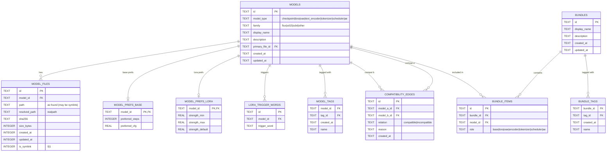

# Model Manager

## Full problem description

### Goal

1) Scan local directories for **supported model “bundles”** and **supported model files**.
2) Present the results in two tabs (**Bundles** and **Models**), sorted alphabetically.
3) Allow users to view details, rename (display name), tag, and enrich entries with examples (images + prompts).
4) Enable creation of new bundles by selecting compatible components only.
5) Persist **compatibility metadata** so future workflows do not require re-reading/parsing the files.

### Non-goals

- No migration from prior implementation (greenfield replacement).
- No online downloads or Hugging Face auth required (local filesystem scanning only).
- Exclude non-target model types (e.g., ControlNet, IP-Adapter, etc.).

---

### Core concepts

#### “Model files” (individual assets)

The app scans a chosen directory recursively and detects supported model assets. Anything not matching recognized patterns is ignored (including ControlNet/IP-Adapter/etc.).

Each recognized model is categorized into one of these types:

- Base checkpoint (e.g., diffusion transformer / main checkpoint)
- LoRA
- VAE
- Text encoder
- Tokenizer
- Scheduler
- Autoencoder / AE
- Other explicitly-supported core files (only if defined)

Each model entry stores:

- Physical file path, hash, size, modified time
- A user-editable display name (not just filename)
- Tags
- Optional metadata depending on type:
  - Base checkpoint: preferred steps, preferred CFG
  - LoRA: preferred strengths, trigger words
- Example images and example prompts (for base checkpoints and LoRAs; optionally extensible)

#### “Bundles” (compatible sets)

A bundle is a curated set of compatible assets used together (e.g., base checkpoint + VAE + text encoders + tokenizers + scheduler + AE).

Users can:

- Scan bundles from existing “well-known” repo structures (e.g., HF-style snapshots with symlinks)
- Create new bundles
- Attach descriptions, tags, example images, example prompts

**Compatibility constraint**: When selecting components for a bundle, only show compatible options (e.g., incompatible VAEs/text encoders must be hidden).

#### Symlink-aware scanning (Hugging Face style)

Hugging Face cache and snapshot layouts commonly use symbolic links. The scanner must:

- Detect symlinks and resolve to target blobs
- Record both the symlink path and resolved target path
- Still identify the “logical” file in the snapshot structure

#### Important exclusion rule: sharded files

For certain models, weights may be sharded:

- model-00001-of-000NN.safetensors
- diffusion_pytorch_model-00001-of-000NN.safetensors
- model.safetensors.index.json

Requirement: **Do not treat sharded pieces or shard index configs as “important files”** for the simplified “bundle signature” selection. The app should focus on single-file weights (where applicable) or only the explicitly “important” files list for that model family.

---

### UX requirements

#### Tabs

1) **Bundles tab**

- Button: Scan Bundles
- Button: Create Bundle
- List of bundles (alphabetically)
- Selecting a bundle shows details + editable metadata + selected components

1) **Models tab**

- Button: Scan Models (choose a directory; recursively scan)
- List of models grouped by type and sorted alphabetically
- Selecting a model shows details + editable metadata

#### Editing

- Rename display name
- Add/remove tags (all model types + bundles)
- Add multiple example images
- Add multiple example prompts
- Type-specific fields:
  - Base checkpoint: preferred_steps, preferred_cfg
  - LoRA: preferred_strength_min/max/default, trigger_words

#### Persistence

Store everything in SQLite:

- Models and their physical file identity (hash, size, mtime)
- Logical identity (display name, tags, examples)
- Compatibility metadata between model types and/or specific model items
- Bundle composition
- Scan runs/logs (optional but strongly recommended)

---

### Sorting & presentation

- All list views sorted alphabetically by display name (fallback: filename).
- Consistent grouping by model type.
- Duplicate detection by content hash (same blob linked multiple places) should collapse into a single logical model with multiple “locations”.

---

### Future-proofing

- Compatibility data should be stored in DB so later UIs can filter compatible components instantly.
- Model classification rules should be extensible without schema changes (store raw classifier output as JSON).

---

## User stories (prioritized)

### Epic: Scanning

1. **Scan Models (recursive)**

   - As a user, I can select a directory and scan recursively to find supported model files only.
   - Acceptance: unsupported types (ControlNet/IP-Adapter/etc.) are excluded; results sorted A→Z.

2. **Scan Bundles (symlink aware)**

   - As a user, I can scan bundle-like structures (including HF snapshot symlinks) and see the “important files” that define a bundle.
   - Acceptance: symlinks are shown with resolved targets; sharded pieces + shard index configs are excluded from “important files”.

3. **Deduplicate identical blobs**

   - As a user, I should not see duplicates if the same blob is referenced in multiple places.
   - Acceptance: one logical model with multiple locations.

### Epic: Model Management

1. **View model details**

   - As a user, I can click a model and see file paths, hash, size, type, and derived compatibility metadata.

2. **Rename model**

   - As a user, I can change the display name independent of the filename.

3. **Tag any model**

   - As a user, I can add/remove tags to any model type.

4. **LoRA preferences**

   - As a user, for LoRAs I can store preferred strength range/default and trigger words.

5. **Base checkpoint preferences**

   - As a user, for base checkpoints I can store preferred steps and preferred CFG.

6. **Examples**

   - As a user, I can add multiple example images and multiple example prompts to base checkpoints and LoRAs.

### Epic: Bundle Management

1. **Create bundle**

- As a user, I can create a bundle, name it, describe it, tag it, and attach examples.

1. **Select compatible components only**

- As a user, when I pick a base model, I can only choose compatible VAEs/text encoders/etc.
- Acceptance: incompatible options are hidden/disabled; compatibility comes from DB metadata.

1. **Edit bundle composition**

- As a user, I can add/remove components, and set roles (e.g., tokenizer vs tokenizer_2).

### Epic: Persistence & Performance

1. **Compatibility persistence**

- As a user, compatibility decisions are stored so future filtering is instant and does not require re-reading model files.

1. **Scan audit**

- As a user, I can see whether a scan succeeded and view errors if it failed.

---

## UI flow design

### Navigation structure

- Left nav (optional): **Bundles** / **Models** / **Settings**
- Main content: tab page with list + details split view

### Bundles tab

1. **Header actions**

   - “Scan Bundles” (folder picker)
   - “Create Bundle”
2. **Bundle list**

   - Sorted A→Z
   - Shows: display name + tag chips + updated date
3. **Bundle details panel**

   - Editable: display name, description, tags
   - Sections:

     - Components (group by role)
     - Examples (images gallery + prompts list)
   - “Edit Components” opens **Bundle Builder Wizard**

### Bundle Builder Wizard (compatibility enforced)

- Step 1: Choose Base Checkpoint (required)
- Step 2: Choose VAE (filtered by compatibility)
- Step 3: Choose Text Encoders (filtered)
- Step 4: Choose Tokenizers (filtered)
- Step 5: Choose Scheduler + AE (filtered)
- Step 6: Review + Save

Filtering behavior:

- As soon as base model selected, all component pickers query `getCompatibleModels(...)`
- If the user changes the base model, downstream selections that are no longer compatible are cleared with a warning toast.

### Models tab

1. **Header actions**

   - “Scan Models” (folder picker)
2. **Model list**

   - Grouped by type (accordion or grouped list)
   - Within each group sorted A→Z
3. **Model details panel**

   - File locations (symlink + resolved path shown)
   - Hash, size, modified time
   - Editable:

     - Display name
     - Description
     - Tags
     - Type-specific prefs
     - Examples (base + lora)

---

## Implementation plan (high-level, pragmatic)

### Phase 1 — Foundations

- Set up Rust crates/modules:

  - `db` (SQLite connection, migrations, repositories)
  - `scanner` (filesystem walk + symlink resolver + hashing)
  - `classifier` (rules for inclusion/exclusion + shard detection)
  - `compat` (compatibility builder + query)
  - `tauri_api` (commands + DTO mapping)
- Set up Vue:

  - PrimeVue layout + Tailwind
  - State management (Pinia recommended)

### Phase 2 — Scanning + persistence

- Implement:

  - Recursive scan with symlink awareness
  - Hashing (sha256) + blob & location tables
  - Classification rules:

    - recognize “important files” per known bundle families
    - detect shards and set `is_shard=1` and `is_important=0`
    - exclude ControlNet/IP-Adapter/etc.
  - Deduplicate by blob hash
- Provide list + details endpoints

### Phase 3 — Editing + examples + tags

- Implement:

  - update model/bundle metadata
  - tag upsert + linking
  - add/remove examples

### Phase 4 — Bundles + compatibility

- Implement:

  - bundle CRUD
  - compatibility_rule persistence
  - candidate filtering endpoint
  - bundle builder wizard UI

### Phase 5 — Polish

- Progress UI for scans (optional incremental events)
- Error surfaces + scan logs
- Performance: incremental hashing, skip unchanged files by (size, mtime) quick checks

Below is a **greenfield Rust module skeleton** for your Tauri backend that matches the API contracts you defined, plus **Mermaid ER diagrams** for an SQLite schema that supports models, bundles, tags, examples, scanning runs, and persisted compatibility.

---

## Mermaid ER Diagrams for SQLite

### SQLite ER Diagram

### Why this ER design fits your requirements

- **Symlink-aware**: `MODEL_FILES.path` vs `resolved_path`
- **No re-parsing**: `COMPATIBILITY_EDGES` persists decisions
- **Type-specific preferences**: separate `MODEL_PREFS_BASE` + `MODEL_PREFS_LORA` + triggers table
- **Tags everywhere**: models + bundles
- **Examples everywhere**: models + bundles, prompts or images
- **Sorted display**: `BUNDLE_ITEMS.sort_order` supports deterministic ordering
