# Image Generation Sequence Diagram

Complete sequence diagram of the Generate Image process, from the user clicking "Generate" to the final image being displayed.

## Diagram

```mermaid
sequenceDiagram
    actor User
    participant GV as GenerateView
    participant GS as GenerationStore
    participant IPC as Tauri IPC
    participant CMD as add_to_queue
    participant DB as SQLite DB
    participant QM as QueueManager
    participant QP as QueueProcessor
    participant MC as ModelCache
    participant FP as FluxPipeline
    participant T5 as T5 Encoder
    participant CLIP as CLIP Encoder
    participant FLUX as FLUX Transformer
    participant VAE as VAE Decoder
    participant FS as Filesystem
    participant GR as GeneratedResults

    %% ─── PHASE 1: User Initiates Generation ───
    rect rgb(59, 130, 246, 0.08)
    Note over User,GR: Phase 1 — Queue Job
    User->>GV: Click "Generate" button
    GV->>GV: handleGenerate()
    GV->>GV: moveCompletedToHistory()
    GV->>GV: Clear previous results, set skeleton placeholders

    loop For each image in batch_size
        GV->>GS: addToQueue(params)
        GS->>IPC: invoke<string>('client_add_to_queue', { params })
        IPC->>CMD: add_to_queue(params)
        CMD->>CMD: Generate image_id (UUID)
        CMD->>DB: create_pending_image(image_id, params, session_id)
        DB-->>CMD: OK
        CMD->>QM: add_job_with_image_id(params, image_id)
        QM->>QM: Store job in HashMap, status = Pending
        QM-->>CMD: job_id
        CMD->>IPC: emit("job-update", {job_id, status: "pending", progress: 0.0})
        IPC-->>GS: Event: job-update (pending)
        GS->>GS: Add job to jobs[], status = "pending"
        CMD-->>GS: return job_id
        GS-->>GV: return job_id
        GV->>GV: Track job_id in currentBatchJobIds
    end
    end

    %% ─── PHASE 2: Queue Processor Picks Up Job ───
    rect rgb(16, 185, 129, 0.08)
    Note over User,GR: Phase 2 — Job Starts Processing
    QP->>QP: process_next_job() [polling loop, 100ms interval]
    QP->>QM: can_start_job()
    QM-->>QP: true (under concurrency limit)
    QP->>QM: Find first Pending job
    QM-->>QP: job (status = Pending)
    QP->>DB: update_image_status(image_id, "processing")
    QP->>QM: update_job_status(job_id, Running)
    QP->>IPC: emit("job-update", {job_id, status: "running", progress: 0.0})
    IPC-->>GS: Event: job-update (running)
    GS->>GS: Update job status = "running", set started_at
    GS-->>GV: Reactive update
    GV->>GR: Show skeleton with floating animation
    end

    %% ─── PHASE 3: Pipeline Setup ───
    rect rgb(139, 92, 246, 0.08)
    Note over User,GR: Phase 3 — Pipeline & Model Setup
    QP->>QP: execute_generation(job, app_handle)

    opt LoRA adapters configured
        QP->>QP: lora_manager.get_or_load_lora(lora_id, device, dtype)
    end

    QP->>MC: get_or_create_pipeline(model_type)
    alt Pipeline exists for model_type
        MC-->>QP: false (reused existing)
    else New pipeline needed
        MC->>FP: FluxPipeline::new(device, model_type)
        FP-->>MC: pipeline instance
        MC-->>QP: true (newly created)
    end

    QP->>FP: set_bundle_context(BundleContext)
    QP->>FP: set_loras(loaded_loras)
    end

    %% ─── PHASE 4: Model Loading ───
    rect rgb(245, 158, 11, 0.08)
    Note over User,GR: Phase 4 — Load Models (lazy, ~24GB total)
    QP->>FP: generate_with_progress(prompt, steps, cfg, w, h, seed, ...)
    FP->>FP: ensure_models_loaded(stats)

    opt T5 not loaded
        FP->>T5: load_t5_encoder(paths, stats)
        Note right of T5: ~9GB VRAM
        T5-->>FP: T5TextEncoder ready
    end

    opt CLIP not loaded
        FP->>CLIP: load_clip_encoder(paths, stats)
        Note right of CLIP: ~1GB VRAM
        CLIP-->>FP: ClipTextEncoder ready
    end

    opt VAE not loaded
        FP->>VAE: load_vae_decoder(paths, stats)
        Note right of VAE: ~335MB VRAM
        VAE-->>FP: VaeDecoder ready
    end

    opt FLUX not loaded
        FP->>FLUX: load_flux_transformer(paths, stats)
        Note right of FLUX: ~12GB VRAM
        FLUX-->>FP: FluxTransformer ready
    end

    FP->>IPC: on_progress(stage: "loading_models", progress: 0.0)
    IPC-->>GS: Event: job-progress {stage: "loading_models"}
    GS->>GS: Update job.currentStage, job.statusMessage
    end

    %% ─── PHASE 5: Text Encoding ───
    rect rgb(236, 72, 153, 0.08)
    Note over User,GR: Phase 5 — Encode Prompt
    FP->>T5: t5.encode(prompt)
    Note right of T5: Tokenize → T5 forward pass → embeddings
    T5-->>FP: t5_embeddings: Tensor

    FP->>IPC: on_progress(stage: "loading_models", progress: 0.5)
    IPC-->>GS: Event: job-progress {stage: "loading_models", stage_progress: 0.5}

    FP->>CLIP: clip.encode(prompt)
    Note right of CLIP: Tokenize → CLIP forward pass → embeddings
    CLIP-->>FP: clip_embeddings: Tensor

    FP->>IPC: on_progress(stage: "loading_models", progress: 1.0)
    IPC-->>GS: Event: job-progress {stage: "loading_models", stage_progress: 1.0}
    GS-->>GV: Reactive update
    end

    %% ─── PHASE 6: Denoising (Diffusion Loop) ───
    rect rgb(239, 68, 68, 0.08)
    Note over User,GR: Phase 6 — Denoise (Diffusion Steps)
    FP->>FLUX: flux.denoise(t5_emb, clip_emb, h, w, steps, guidance, seed, sampler, scheduler)

    loop For each step (1..steps)
        FLUX->>FLUX: Apply noise schedule (sampler + scheduler)
        FLUX->>FLUX: Forward pass through transformer blocks
        FLUX-->>FP: Step callback(current_step, total_steps, latents)

        FP->>IPC: on_progress(stage: "denoising", step: N/total, overall: 0.5-0.95)
        IPC-->>GS: Event: job-progress {stage: "denoising", current_step, total_steps}
        GS->>GS: Update job.progress, job.currentStep, job.totalSteps

        opt Preview interval (at 20%, 40%, 60%, 80%, 100%)
            FP->>FP: Unpack latents [1,2048,H] → [1,16,H/8,W/8]
            FP->>VAE: vae.decode(preview_latents)
            VAE-->>FP: preview RGB data
            FP->>FP: encode_jpeg_base64(rgb, quality=60)
            FP->>IPC: on_progress(preview_data: base64_jpeg)
            IPC-->>GS: Event: job-progress {preview_data: "base64..."}
            GS->>GS: Update job.previewData
            GS-->>GV: Reactive update
            GV->>GR: Overlay preview image on skeleton
        end
    end

    FLUX-->>FP: denoised_latents: Tensor
    end

    %% ─── PHASE 7: VAE Decode ───
    rect rgb(20, 184, 166, 0.08)
    Note over User,GR: Phase 7 — VAE Decode & PNG Encode
    FP->>FP: Unload CLIP (~1GB freed)

    FP->>VAE: vae.decode(latents)
    Note right of VAE: Latent space → pixel space
    VAE-->>FP: image_tensor
    FP->>VAE: vae.tensor_to_rgb(image_tensor)
    VAE-->>FP: rgb_bytes: Vec<u8>

    FP->>IPC: on_progress(stage: "decoding_vae", progress: 1.0, overall: 0.95-0.98)
    IPC-->>GS: Event: job-progress {stage: "decoding_vae"}

    FP->>FP: encode_png_with_metadata(rgb, w, h, metadata)
    Note right of FP: Embed prompt, seed, steps,<br/>model, sampler in PNG metadata
    FP->>FP: Generate final preview JPEG (quality=75)

    FP->>IPC: on_progress(stage: "encoding_png", progress: 1.0, overall: 0.98-1.0)
    IPC-->>GS: Event: job-progress {stage: "encoding_png"}

    FP-->>QP: GenerationResult {image_data, stats}
    end

    %% ─── PHASE 8: Save & Complete ───
    rect rgb(99, 102, 241, 0.08)
    Note over User,GR: Phase 8 — Save Image & Complete Job
    QP->>FS: Write PNG to ~/.rzem-ai-inference/outputs/flux_{timestamp}_{seed}.png
    FS-->>QP: file_path

    QP->>QP: Generate thumbnail (400x400 JPEG)
    QP->>FS: Write thumbnail flux_{timestamp}_{seed}_cover.jpg
    FS-->>QP: thumbnail_path

    QP->>DB: update_image_on_completion(image_id, file_path, thumbnail_path, w, h, file_size, gen_time_ms)
    QP->>DB: insert_generation_stats(image_id, stats)
    Note right of DB: Records: t5_encode_ms, clip_encode_ms,<br/>denoise_ms, vae_decode_ms, png_encode_ms

    opt Auto-tagging enabled
        QP->>QP: Spawn async auto-tag task
        Note right of QP: Runs independently,<br/>emits auto-tag-complete later
    end

    QP->>MC: apply_post_generation_cleanup()
    Note right of MC: Unload T5 (~9GB), keep FLUX + VAE

    QP->>QM: complete_job(job_id, image_path)
    QP->>IPC: emit("job-update", {job_id, status: "completed", progress: 1.0, result_path})
    end

    %% ─── PHASE 9: Frontend Displays Image ───
    rect rgb(34, 197, 94, 0.08)
    Note over User,GR: Phase 9 — Display Final Image
    IPC-->>GS: Event: job-update (completed, result_path)
    GS->>GS: Update job: status="completed", result_path, completed_at

    par Gallery refresh
        GS->>IPC: invoke('get_gallery_images', {limit: 100})
        IPC-->>GS: GalleryImage[] (updated list)
    end

    GV->>GV: watch(jobs) detects newly completed job
    GV->>GV: convertFileSrc(result_path) → Tauri asset URL
    GV->>GR: Push to generatedImages[], remove skeleton
    GR->>GR: Render final image with download button
    GR-->>User: Final generated image displayed
    end
```

## Participants

| Participant | Layer | Description |
|---|---|---|
| **User** | UI | Clicks Generate button |
| **GenerateView** | Vue Component | `src/views/GenerateView.vue` — Main generation page |
| **GenerationStore** | Pinia Store | `src/stores/generation.ts` — Manages jobs state + event listeners |
| **Tauri IPC** | Bridge | Tauri invoke commands + event system |
| **add_to_queue** | Rust Command | `src-tauri/src/lib.rs` — Entry point Tauri command |
| **SQLite DB** | Database | `src-tauri/src/db/images.rs` — Image metadata persistence |
| **QueueManager** | Rust Service | `src-tauri/src/queue/mod.rs` — Job scheduling + state |
| **QueueProcessor** | Rust Service | `src-tauri/src/queue/processor.rs` — Async job execution loop |
| **ModelCache** | Rust Service | `src-tauri/src/inference/cache.rs` — Pipeline caching + cleanup |
| **FluxPipeline** | Rust ML | `src-tauri/src/inference/flux_pipeline/` — Orchestrates inference |
| **T5 Encoder** | ML Model | `src-tauri/src/models/t5.rs` — Text → embeddings (~9GB) |
| **CLIP Encoder** | ML Model | `src-tauri/src/models/clip.rs` — Text → embeddings (~1GB) |
| **FLUX Transformer** | ML Model | `src-tauri/src/models/flux.rs` — Diffusion denoising (~12GB) |
| **VAE Decoder** | ML Model | `src-tauri/src/models/vae.rs` — Latent → pixels (~335MB) |
| **Filesystem** | OS | Output images + thumbnails |
| **GeneratedResults** | Vue Component | `src/components/generation/GeneratedResults.vue` — Image display |

## Key API Calls

### Tauri Invoke Commands (Frontend → Backend)

| Command | Parameters | Returns | Purpose |
|---|---|---|---|
| `client_add_to_queue` | `params: GenerationParams` | `string` (job_id) | Queue a new generation job |
| `client_get_queue_jobs` | — | `GenerationJob[]` | Fetch all jobs |
| `client_cancel_queue_job` | `jobId: string` | `boolean` | Cancel a running/pending job |
| `get_gallery_images` | `limit: number` | `GalleryImage[]` | Refresh gallery after completion |

### Tauri Events (Backend → Frontend)

| Event | Payload | When |
|---|---|---|
| `job-update` | `{job_id, status, progress, result_path?, error?}` | Status transitions: pending → running → completed/failed |
| `job-progress` | `{job_id, stage, stage_progress, overall_progress, message, current_step?, total_steps?, preview_data?, eta_seconds?}` | During generation: model loading, encoding, each denoise step, VAE decode, PNG encode |
| `auto-tag-complete` | `{image_id, tags[], backend}` | After async auto-tagging finishes (post-completion) |

### Pipeline Stages (in `job-progress` events)

| Stage | Overall Progress | Description |
|---|---|---|
| `loading_models` | 0.0 – 0.5 | Lazy-load T5, CLIP, VAE, FLUX + encode prompt |
| `denoising` | 0.5 – 0.95 | Diffusion steps with optional preview generation |
| `decoding_vae` | 0.95 – 0.98 | Decode latents to RGB pixels |
| `encoding_png` | 0.98 – 1.0 | Encode PNG with embedded metadata |
